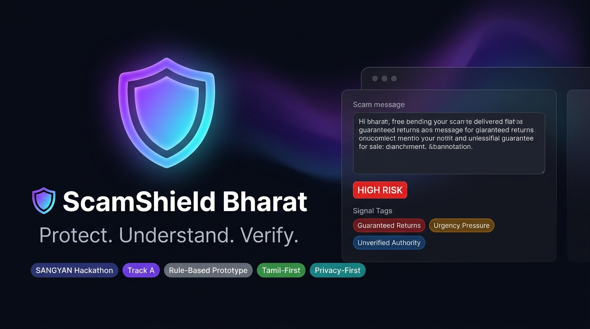
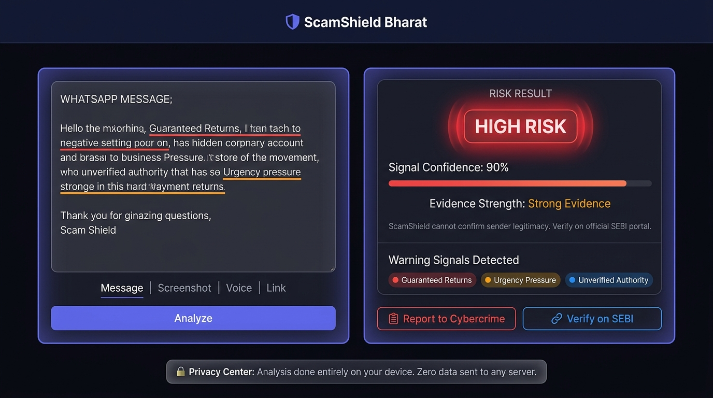
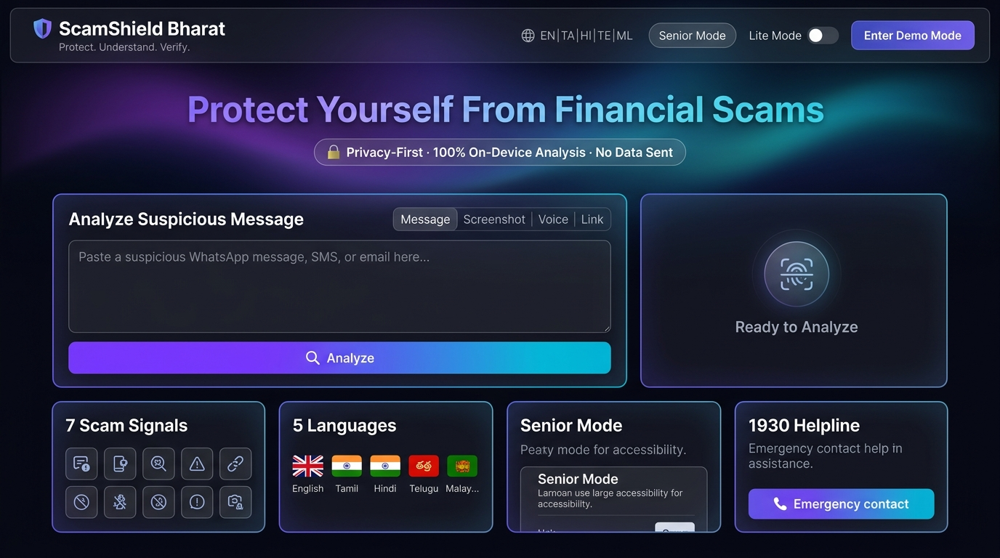
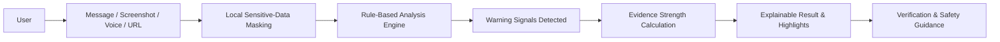

<div align="center">

<p align="center">
  
</p>

# 🛡️ ScamShield Bharat
### **Protect. Understand. Verify.**

**Explainable investor-safety technology for India's elderly and first-time investors.**

[](https://github.com/surdish/scamshield-bharat)
[](https://github.com/surdish/scamshield-bharat)
[](https://github.com/surdish/scamshield-bharat)
[](https://github.com/surdish/scamshield-bharat)
[](https://github.com/surdish/scamshield-bharat)

<br/>

<p align="center">
  <a href="https://gilded-clafoutis-d62dd0.netlify.app/">
    
  </a>
  &nbsp;
  <a href="https://github.com/surdish/scamshield-bharat">
    
  </a>
  &nbsp;
  <a href="SUBMISSION.md">
    
  </a>
</p>

</div>

---

<p align="center">
  
</p>
<p align="center">
  <em>A working browser-based prototype for explainable digital investment-scam awareness.</em>
</p>

---

<div align="center">
  <h3>🔍 Detect &nbsp;→&nbsp; 💡 Understand &nbsp;→&nbsp; 🌐 Verify &nbsp;→&nbsp; 🛡️ Stay Safe</h3>
  <p><em>ScamShield Bharat does not simply label content. It explains the specific signals behind every result.</em></p>
</div>

| Stage | Capability | Description |
| :--- | :--- | :--- |
| **01 · DETECT** | **Pattern Identification** | Identify high-risk heuristic patterns across suspicious investment messages, links, screenshots, or voice transcripts. |
| **02 · UNDERSTAND** | **Explainable Signals** | Highlight exact suspicious text spans and present transparent, jargon-free explanations for why claims trigger warnings. |
| **03 · VERIFY** | **Independent Validation** | Guide users directly to official registries (SEBI SCORES, sebi.gov.in) before committing any money. |
| **04 · STAY SAFE** | **Actionable Safeguards** | Provide clear prevention checklists and direct emergency escalations (1930 Cyber Fraud Helpline, cybercrime.gov.in). |

---

## 🚨 The Problem

First-time and elderly retail investors in India's Tier-2 and Tier-3 cities are targeted daily through WhatsApp, Telegram, SMS, and unsolicited social calls. Fraudulent solicitations exploit low digital familiarity using manipulative psychological triggers:

- **Guaranteed Returns**: Fabricated claims such as *"40% profit in 7 days"* or *"double your deposit safely"*.
- **Artificial Urgency**: Coercive timers like *"offer valid for next 30 minutes"* or *"limited seats"*.
- **Unverified Authority**: Forged regulator logos, fake circulars, or fraudulent claims of being *"SEBI / RBI approved"*.
- **Coercive Payment Demands**: Requests for upfront processing, tax deposit, or activation fees via personal UPI IDs.
- **Credential & Security Theft**: Solicitation of one-time passwords (OTPs), UPI PINs, bank passwords, or CVVs.
- **Suspicious Links & APKs**: Shortened links, deceptive homoglyph domains, and phishing forms.
- **Unsolicited Investment Groups**: Random additions to speculative "VIP trading advisory" groups.

> ### 👴 Design Persona: Ravi Kumar (62, Salem, Tamil Nadu)
> * **Profile**: Retired government employee; first-time retail smartphone user.
> * **Preferences & Constraints**: Prefers Tamil language; limited digital financial literacy; often uses unstable mobile connections; struggles with micro-typography and complex nested settings.
> * **Design Impact**: ScamShield Bharat is engineered around Ravi's needs—featuring a dedicated 1-click **Senior Mode** (large high-contrast text, 60px tap targets), complete **Tamil localization**, and zero mandatory onboarding hurdles.
> 
> *(Note: Ravi Kumar is a fictional design persona used to guide prototype usability and accessibility design decisions.)*

---

## 💡 Designed for Understanding, Not Just Detection

```
┌─────────────────────────────────────────────────────────────────────────────┐
│                       WHY SCAMSHIELD BHARAT IS DIFFERENT                     │
└─────────────────────────────────────────────────────────────────────────────┘
  🔎 Explainable         → Every warning connects directly to visible evidence spans
  🇮🇳 Bharat-First        → Built Tamil-first with support for 5 Indian languages
  👴 Senior-Friendly     → 1-tap Senior Mode with WCAG AAA contrast & big touch targets
  🔒 Privacy-First       → Sensitive numbers masked locally in-browser before analysis
  🤔 Uncertainty-Aware   → Transparently returns "Inconclusive" when evidence is weak
```

---

## 🖥️ Product Preview

<table align="center" width="100%">
  <tr>
    <td width="50%" align="center">
      <br/>
      <strong>High-Risk Analysis</strong><br/>
      <em>Explainable warning signals, confidence levels, and honest uncertainty disclaimers.</em>
    </td>
    <td width="50%" align="center">
      <br/>
      <strong>Tamil Experience</strong><br/>
      <em>Simple regional-language safety guidance and translated heuristic signal explanations.</em>
    </td>
  </tr>
  <tr>
    <td width="50%" align="center">
      <br/>
      <strong>Senior Mode</strong><br/>
      <em>High contrast, large fonts, enlarged touch targets, and simplified action controls.</em>
    </td>
    <td width="50%" align="center">
      <br/>
      <strong>Privacy Center</strong><br/>
      <em>Clear transparency on local on-device processing without server message retention.</em>
    </td>
  </tr>
</table>

---

## ⚡ Architecture

### System Flow


### 1. Prototype Architecture (Implemented)
- **Browser-Based Processing**: Runs client-side with zero external build toolchain; executable directly via `file://` or static web hosting.
- **Deterministic Rule Engine (`engine.js`)**: Evaluates multi-pattern heuristic sets across English, Tamil, and Hinglish keyword variants.
- **Local Sanitization Layer**: In-memory regex masking automatically obfuscates card numbers, phone numbers, and credentials before signal evaluation.
- **Client-Side Localization (`i18n.js`)**: Dynamic DOM node translation covering English, Tamil (தமிழ்), Hindi (हिन्दी), Telugu (తెలుగు), and Malayalam (മലയാളം).
- **Optional Client Integrations**: Web Speech API for voice transcript analysis and lazy-loaded Tesseract.js for client-side OCR.

### 2. Production Direction (Planned Roadmap)
- **FastAPI Microservices**: Asynchronous orchestration layer for structured inference pipelines.
- **Multilingual NLP Classifier**: Fine-tuned Indian-language Transformer embeddings for semantic intent detection beyond keyword matching.
- **Explainable LLM Layer**: Controlled grounding layer (e.g., Gemini Flash / Llama-3) to synthesize concise vernacular reasoning summaries.
- **Registry Integration**: Live REST query connectors to verified SEBI SCORES, RBI registries, and CERT-In threat advisories.
- **URL Threat Intelligence**: Live safe-browsing reputation queries for flagged domain infrastructures.

---

## 🧠 Explainable Rule Engine

ScamShield Bharat evaluates messages across 7 core investor-safety vectors:

| Signal Category | Exemplar Indicators | Risk Weight |
| :--- | :--- | :---: |
| **Guaranteed / Fixed Returns** | *"40% guaranteed"*, *"double your money in 7 days"*, *"zero risk investment"* | **High** |
| **Artificial Urgency** | *"today only"*, *"transfer within 30 minutes"*, *"strictly limited offer"* | **Medium** |
| **Unverified Authority Claims** | *"SEBI approved scheme"*, *"Govt certified wealth portal"*, *"RBI verified"* | **High** |
| **Coercive Payment Requests** | *"activation fee"*, *"deposit registration charges"*, personal UPI VPA addresses | **High** |
| **Credential / Security Theft** | Demands for OTPs, UPI PINs, debit card security numbers, or banking passwords | **Critical** |
| **Suspicious Links & Domains** | URL shorteners (`bit.ly`, `tinyurl`), raw IP URLs, suspicious TLDs (`.xyz`, `.top`) | **Medium** |
| **Unsolicited Influx** | Unsolicited trading group invites, secret insider group guarantees | **Medium** |

*Each signal match highlights the exact span within the original message and calculates an evidence-based confidence metric (strictly capped at 90% to acknowledge heuristic limits).*

---

## 🎯 Result Model

| Result Level | Meaning & Indicator | User Guidance |
| :--- | :--- | :--- |
| 🟢 **NO MAJOR WARNING SIGNALS** | No high-risk heuristic patterns found in the submitted text. | *Does NOT guarantee the source is safe. Always verify independently through official portals.* |
| 🟠 **POTENTIAL RISK** | Isolated warning signals identified (e.g., unverified links or urgency phrasing). | *Exercise caution. Never transfer funds or share details until independently validated.* |
| 🔴 **HIGH RISK** | Multiple corroborating fraud signals detected (e.g., guaranteed returns + urgency + payment demand). | *Do not engage or send money. Block the contact and report to official cyber helplines.* |
| ⚪ **INCONCLUSIVE** | Content is too brief or ambiguous (e.g., *"Hi"*, *"Good morning"*). | *Insufficient evidence to evaluate risk. Request official documentation before acting.* |

> **⚠️ Note on Confidence**: Signal confidence represents how much evidence was found in the text, not a statistical guarantee that a message is or is not fraudulent.

---

## 🧪 Benchmark & Test Cases

These verifiable test cases validate the client-side rule evaluation engine:

| Test Scenario | Sample Input Pattern | Expected Outcome | Engine Verification |
| :--- | :--- | :---: | :---: |
| **Guaranteed Return Scam** | *"Guaranteed 40% return in 7 days. Send Rs 10,000 to activate."* | **HIGH RISK** | Triggers Guaranteed Return + Payment Request |
| **Credential Phishing** | *"Dear investor, share OTP and UPI PIN to claim registered dividend."* | **HIGH RISK** | Triggers Credential Theft warning |
| **High Urgency Scam** | *"Pay Rs 5,000 within 30 minutes to lock your exclusive trading slot."* | **HIGH RISK / POTENTIAL** | Triggers Urgency Pressure + Payment Request |
| **Neutral Notification** | *"Your monthly mutual fund account statement is ready to view."* | **NO MAJOR SIGNALS** | Clean evaluation; zero false heuristic triggers |
| **Ambiguous / Minimal Input** | *"Hi"* or *"Hello sir"* | **INCONCLUSIVE** | Avoids false accusations; flags insufficient context |
| **Tamil Language Scam** | *"உறுதியான 50% லாபம்! உடனே முதலீடு செய்யுங்கள்."* | **HIGH RISK** | Triggers Tamil vernacular pattern recognition |
| **Sensitive Data Redaction** | Message containing *"Card 4111 2222 3333 4444 and OTP 987654"* | **Masked on Device** | Strips sensitive numbers in browser memory |
| **Demo Session Access** | Click *"Enter Demo Mode"* in navigation | **Instant Session** | Zero phone number or OTP verification required |

---

## 🔐 Privacy by Design

```
[User Message] ──> [In-Browser Regex Sanitizer] ──> [Deterministic Evaluator] ──> [Visual Highlights]
                              │
                    Sensitive Numbers Masked
                    (Zero Server Transmission)
```

**What ScamShield Bharat NEVER asks for:**
- ❌ Bank account numbers or passwords
- ❌ UPI PINs or ATM PINs
- ❌ Debit / Credit card CVVs
- ❌ Personal phone numbers or SMS OTPs

*In this prototype, all text processing and signal parsing executes locally inside the browser environment. No chat transcripts are stored or logged on external servers.*

---

## ✨ Feature Matrix

| Feature Area | Current Status | Description |
| :--- | :---: | :--- |
| **Text Pattern Analysis** | 🟢 Implemented | 7-vector heuristic pattern matching for suspicious messages |
| **Explainable Warning Highlights** | 🟢 Implemented | Color-coded inline text markers and expandable rationale cards |
| **Tamil Language Localization** | 🟢 Implemented | Full Tamil language interface and regex pattern support |
| **Senior Mode** | 🟢 Implemented | High contrast, enlarged fonts, and WCAG AAA target sizing |
| **Lite Mode** | 🟢 Implemented | CSS/DOM optimizations tailored for low-bandwidth 2G/3G connections |
| **Local Privacy Masking** | 🟢 Implemented | Automatic client-side redacting of payment numbers and OTPs |
| **Frictionless Demo Mode** | 🟢 Implemented | 1-click evaluation access with zero phone or login requirements |
| **URL Signal Analysis** | 🟢 Implemented | Client-side heuristic inspection of domains, protocols, and IP paths |
| **Screenshot OCR** | 🟡 Optional / Network Dependent | Optional client-side image character recognition via Tesseract.js |
| **Voice Input Support** | 🟡 Browser Dependent | Vernacular speech capture leveraging browser Web Speech API |
| **Multilingual NLP Classifier** | 🔵 Planned Roadmap | Production semantic transformer inference for complex code-mixed text |
| **LLM Vernacular Explainer** | 🔵 Planned Roadmap | Context-aware regional language reasoning explanations |
| **Live URL Threat Intel** | 🔵 Planned Roadmap | API-backed malicious domain scoring and threat telemetry |
| **Official Registry Lookups** | 🔵 Planned Roadmap | Direct automated verification against SEBI/RBI registered intermediary APIs |

---

## 🚀 Quick Start

Because ScamShield Bharat is engineered with a zero-build client-side stack, you can inspect and run it immediately:

```bash
# 1. Clone the repository
git clone https://github.com/surdish/scamshield-bharat.git

# 2. Navigate to directory
cd scamshield-bharat

# 3. Open in any modern web browser
# On Windows:
start index.html
# On macOS:
open index.html
# On Linux:
xdg-open index.html
```

*No Node.js, Python, compiler, database, or API keys are required to run the core prototype.*

---

## 🌐 Try ScamShield Bharat Live

Explore the working deployment without any local setup:

<p align="center">
  <a href="https://gilded-clafoutis-d62dd0.netlify.app/">
    
  </a>
</p>

> **Evaluation Quick-Tip**: Click **"Enter Demo Mode"** in the top-right header to activate full demonstration mode without needing to provide any phone number or credentials.

---

## 🎬 60-Second Evaluator Walkthrough

For hackathon judges evaluating the project in under a minute:

1. **Open the Live Demo**: Navigate to [gilded-clafoutis-d62dd0.netlify.app](https://gilded-clafoutis-d62dd0.netlify.app/).
2. **Activate Demo Mode**: Select **"Enter Demo Mode"** in the navigation bar.
3. **Try a Scam Sample**: Click the **"Try Scam Example"** button in the analysis panel.
4. **Trigger Analysis**: Click **"Analyze Message"**.
5. **Inspect the Evidence**: Notice the detected risk badge (**HIGH RISK**), the evidence breakdown, and the inline color-coded text highlights.
6. **Toggle Senior Mode**: Click **"Senior Mode"** in the navigation bar to preview accessibility-focused UI enhancements.
7. **Switch to Tamil**: Select **தமிழ் (Tamil)** in the language dropdown to review localized guidance.
8. **Inspect Privacy Center**: Scroll to the **Privacy Center** section to see local data-masking guarantees.

---

## 🛡️ What Users Can Do (Safety & Reporting)

ScamShield Bharat connects retail investors directly with authorized national redressal mechanisms:

| Action Pillar | Guidance | Official Mechanism |
| :--- | :--- | :--- |
| **⏸️ PAUSE** | Never transfer funds or confirm agreements under artificial time pressure. | Safety Checklist |
| **🔍 VERIFY** | Independently confirm whether an entity is registered before investing. | [SEBI Official Portal (sebi.gov.in)](https://www.sebi.gov.in) |
| **🔒 NEVER SHARE** | Never disclose OTPs, banking passwords, or UPI PINs to anyone claiming to represent authorities. | In-App Advisory |
| **📝 SAVE EVIDENCE** | Retain chat logs, payment receipts, bank SMS records, and UPI transaction reference numbers. | User Action Step |
| **🚨 REPORT FRAUD** | Lodge urgent complaints within the "Golden Hour" of financial fraud. | **National Cyber Crime Portal**: [cybercrime.gov.in](https://cybercrime.gov.in) <br/> **National Helpline**: `1930` |

*(Note: ScamShield Bharat provides links and instructional guidance for official reporting portals; it does not claim formal partnership or direct API integration with these agencies in the current prototype.)*

---

## ♿ Designed for Real Users

To ensure genuine Bharat-first usability for elderly and non-technical citizens:
- **Language Inclusivity**: First-class Tamil localization alongside Hindi, Telugu, Malayalam, and English.
- **Senior Mode (WCAG AAA)**: 1-click transformation featuring larger font scales, heightened color contrast, and minimum 60px tap targets for motor accessibility.
- **Lite Mode**: Strips heavy blur filters, backdrop effects, and animation pipelines to ensure smooth operation on 2G/3G connections and budget hardware.
- **Voice Accessibility**: Web Speech API integration allows users to speak suspicious messages aloud rather than typing.
- **Clear Information Architecture**: Distinguishes explainable signals from generic statistical percentages.

---

## 🗺️ Roadmap

```
[ NOW: Hackathon Prototype ]
  • Client-side rule engine (7 scam vectors)
  • Tamil + English full localization (Hindi/Telugu/Malayalam UI)
  • In-browser local number masking & privacy center
  • Senior Mode (WCAG AAA) & Lite Mode (low-bandwidth)
  • Instant 1-click Demo Mode (zero authentication friction)

               │
               ▼

[ NEXT: Near-Term Enhancements ]
  • Expansion to Kannada, Marathi, Bengali, and Gujarati
  • Vernacular voice query processing improvements
  • Localized audio readout for elderly and visually impaired users
  • Lightweight on-device offline NLP model integration

               │
               ▼

[ FUTURE: Production Infrastructure ]
  • FastAPI backend microservice architecture
  • Live query lookups against SEBI / RBI registered entity registries
  • URL reputation scoring and live threat telemetry feeds
  • Bank and messaging app protective sidecar integrations
```

---

## 📁 Repository Structure

```
scamshield-bharat/
├── index.html         # Self-contained web application (HTML, UI, inlined runtime scripts)
├── engine.js          # Deterministic 7-vector scam analysis rule engine
├── i18n.js            # Multilingual localization matrix (EN, TA, HI, TE, ML)
├── app.js             # Application controller, UI state orchestration & test runner
├── styles.css         # Modern glassmorphism stylesheet & responsive layout tokens
├── README.md          # Comprehensive judge-ready product documentation
├── SUBMISSION.md      # SANGYAN Hackathon Track A submission package & presentation script
├── .gitignore         # Build and repository artifact exclusion rules
└── assets/            # Interface screenshots, previews, and architectural visuals
    ├── hero.png
    ├── analysis-high-risk.png
    ├── tamil-mode.png
    ├── senior-mode.png
    ├── privacy-center.png
    ├── mobile-view.png
    ├── social-preview.png
    └── logo.svg
```

---

## 🧩 Technology Stack

| Component | Technology | Rationale |
| :--- | :--- | :--- |
| **Frontend Framework** | Vanilla HTML5 & CSS3 | Zero dependency overhead, immediate render speed, cross-device stability |
| **Runtime Language** | Modern ES6+ JavaScript | Deterministic client-side evaluation without build tools |
| **Typography & Theme** | Google Fonts (Inter) | High-legibility modern digital product aesthetic |
| **Visual Architecture** | Glassmorphism & Aurora Grids | Premium presentation inspired by modern SaaS interfaces |
| **OCR Capability** | Tesseract.js (Optional CDN) | Lazy-loaded client-side image text extraction |
| **Voice Interface** | Browser Web Speech API | Native speech-to-text input without third-party audio transmission |
| **Hosting & Deployment**| Netlify Static Edge | Global static edge delivery with HTTPS |

---

## ⚠️ Prototype Limitations

In the interest of full technical transparency:
1. **Rule-Based Evaluation**: The prototype relies on heuristic pattern matching. It does not employ statistical deep learning or large language models, meaning novel, subtly worded scams may not trigger alerts (false negatives), and certain legitimate promotional texts may trigger warnings (false positives).
2. **Sender Identity Verification**: The system analyzes message text and link patterns. It cannot independently authenticate the real-world identity of an unknown sender or phone number.
3. **URL Heuristics**: Link signal analysis checks syntax, protocols, and top-level domain structures; it does not perform active sandboxed web browsing.
4. **Hardware & Environment Dependencies**: Web Speech voice input and Tesseract.js OCR require compatible browsers, microphone permissions, and sufficient network capacity to fetch OCR worker scripts.
5. **Localization Review**: Regional language phrases are maintained via static dictionary tables and benefit from continuous native-speaker refinement.

---

## 🌏 From Prototype to Investor-Safety Infrastructure

ScamShield Bharat envisions a future where every retail investor in India has an accessible, explainable safety layer standing between them and fraudulent digital transactions. By bridging the gap between complex regulatory warnings and grassroots vernacular communication, ScamShield aims to transform passive victims into resilient, informed decision-makers.

---

## 🤝 Contributing

Contributions, feedback, and issue submissions are welcome:
1. Fork the repository (`https://github.com/surdish/scamshield-bharat`).
2. Create your feature branch (`git checkout -b feature/NewCapability`).
3. Commit your changes (`git commit -m 'Add new capability'`).
4. Push to the branch (`git push origin feature/NewCapability`).
5. Open a Pull Request.

---

## 📄 License

*License to be determined.*

---

<div align="center">

**ScamShield Bharat** · SANGYAN Investor Resilience Hackathon · Track A  
*Protect. Understand. Verify.*

</div>
